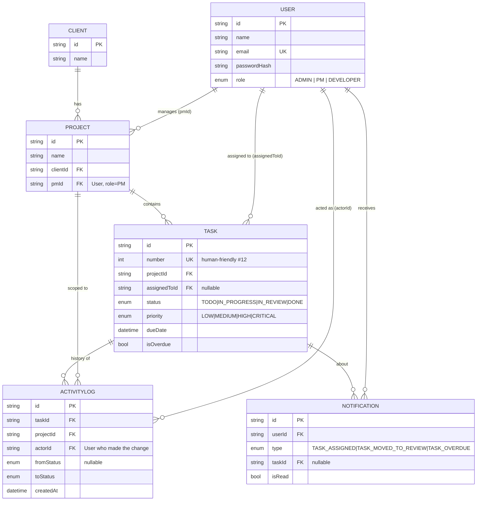

# Velozity — Client Project & Task Management

A full-stack internal tool for an agency to manage clients, projects, tasks, and real-time team
activity, with strict role-based access control (Admin / Project Manager / Developer).

## Stack

- **Frontend:** React + TypeScript (Vite), Tailwind CSS, `react-router-dom`, `socket.io-client`
- **Backend:** Node.js + **Express** + TypeScript
- **Database:** PostgreSQL via **Prisma**
- **Real-time:** **Socket.io** (not raw WebSocket, not SSE, not long-polling)
- **Background jobs:** **node-cron**
- **Auth:** JWT access token (15 min, memory-only on the client) + JWT refresh token (7 days,
  HttpOnly cookie)

---

## Architecture decisions & justifications

### Why Express over Fastify
Both would satisfy the requirements. Express was chosen because this project leans heavily on a
large surface of small, synchronous-feeling middleware (auth, role checks, zod validation,
structured error handling) where Express's simplicity and enormous ecosystem of examples reduce
integration risk more than Fastify's raw throughput advantage matters here — this is an internal
agency tool serving a small team, not a high-QPS public API. Fastify would be the better choice if
raw request throughput or built-in JSON-schema validation performance were the bottleneck.

### Why Socket.io over raw WebSocket or SSE
- **Raw WebSocket** would require hand-rolling reconnection/backoff, room/broadcast semantics
  (needed here for per-project rooms, per-role feeds, and presence), and a fallback transport.
  Socket.io provides all of this out of the box and is battle-tested for exactly this "rooms +
  broadcast" pattern.
- **SSE** is one-directional (server → client) and was explicitly disallowed, but even if it
  weren't: this app needs client → server signals too (joining/leaving a project room), which SSE
  can't do without a second channel.
- Socket.io's **room** abstraction maps directly onto the access-control model: a project room
  (`project:{id}`), an admin global room (`admin-feed`), a per-PM room (`pm-feed:{pmId}`), and a
  per-developer room (`dev-feed:{devId}`). Broadcasting to the right rooms is how role-scoped
  real-time visibility is enforced without re-implementing pub/sub.

### Why node-cron over Bull for the overdue sweep
The overdue check is a single, idempotent, lightweight SQL sweep (`UPDATE tasks SET isOverdue =
true WHERE dueDate < now() AND status != DONE AND isOverdue = false`) that runs every 5 minutes.
It doesn't need retries with backoff, distributed workers, or persisted job payloads — the
things Bull (Redis-backed) is built for. node-cron's in-process scheduler is the right amount of
infrastructure for this job. If the app later grows job types that need durability across restarts
or multiple worker processes (e.g., bulk email sends, retryable webhooks), Bull would be the
better fit and could be introduced without touching this job's logic.

### Auth: why the refresh token is an HttpOnly cookie, not localStorage
Storing a long-lived credential in localStorage makes it readable (and stealable) by any script
running on the page, including a successful XSS payload. Putting it in an `HttpOnly` cookie means
client-side JavaScript can never read it, only send it automatically with same-origin requests.
The short-lived access token still lives in memory on the client (never persisted) purely for
attaching to `Authorization: Bearer` headers and Socket.io handshakes; losing it on page refresh is
expected and handled by a silent `/api/auth/refresh` call on app load.

### Enforcing role boundaries at the data layer, not just the route layer
Route-level `authorize(...)` middleware only checks "is this role allowed to hit this route at
all" — it cannot tell a PM's own project apart from another PM's project. That distinction is
enforced in the **service layer** against the database on every read and write:
- `project.service.ts#getProjectOrThrow` re-checks `project.pmId === actor.id` for PMs, and checks
  the developer actually has a task in the project for developers — regardless of what the JWT's
  role claims, a request for someone else's project 404/403s.
- `task.service.ts#scopedWhere` injects `assignedToId = actor.id` for developers and
  `project.pmId = actor.id` for PMs directly into the Prisma `where` clause, so the database
  itself never returns rows outside the caller's scope — there is no "filter after fetching"
  step that a bug could accidentally skip.
- Socket room joins (`project:join`) re-run the same access check server-side before allowing a
  socket into a room, so a modified/replayed client-side join request can't eavesdrop on another
  project's live feed.

### Database indexing decisions (see `prisma/schema.prisma` inline comments)
- `Task.projectId`, `Task.assignedToId`: every task list is either "tasks in this project" or
  "tasks assigned to this developer" — both are hit on nearly every page load.
- `Task.status`, `Task.priority`, `Task.dueDate`: these back the shareable filter query params
  (`?status=&priority=&dueBefore=&dueAfter=`) and the dashboard `groupBy` aggregations.
- `Task(projectId, status)` composite: the most common compound filter (a project's board grouped
  by column).
- `ActivityLog(projectId, createdAt)` and `(taskId, createdAt)`: the activity feed always
  queries "most recent N events for this project/task", i.e., an equality filter plus a sort —
  exactly what a composite index on `(filter_col, sort_col)` is for.
- `Notification(userId, isRead)` and `(userId, createdAt)`: the bell always queries "my unread"
  and "my most recent," both keyed off `userId`.
- `Project.pmId`: backs "list my projects" for the PM dashboard.

### Task activity log is a durable table, not derived state
`ActivityLog` rows are written in the same Prisma `$transaction` as the task's status update,
so the log can never desync from the task's real history, and a page reload or a client that was
offline can always reconstruct "what happened" by querying the table — nothing is held only in
server memory.

---

## Project structure

```
velozity-app/
  docker-compose.yml     # one-command local setup: Postgres + backend + frontend
  README.md
  backend/
    Dockerfile
    .dockerignore
    prisma/
      schema.prisma       # models, enums, indexes
      seed.ts              # seed data (see below)
    src/
      config/              # env loading, Prisma client singleton
      middleware/           # auth, role guard, validation, error handler
      routes/                # Express routers
      controllers/            # request/response glue + zod schemas
      services/                # business logic + DB access + access control
      sockets/                  # Socket.io server, rooms, presence, broadcast helpers
      jobs/                      # node-cron overdue sweep
      utils/                      # ApiError, JWT helpers
  frontend/
    Dockerfile
    .dockerignore
    src/
      api/         # fetch client with token refresh
      context/      # AuthContext, SocketContext
      components/    # ActivityFeed, TaskList, NotificationBell, Layout
      pages/           # Login, {Admin,PM,Developer}Dashboard, ProjectDetail
      types/            # shared TS types mirroring backend models
```

---

## Database schema

Six tables, all connected through foreign keys — no denormalized/derived state. `ActivityLog` and
`Notification` are both append-only logs: rows are never edited, only inserted (and `Notification`
rows are flipped `isRead`).



**Relationships in plain terms:**
- A `Client` has many `Project`s. Each `Project` belongs to exactly one `Client` and exactly one
  `User` with role `PM` (its owner/manager) — this `pmId` is what enforces "a PM can only see
  their own projects" at the query level.
- A `Project` has many `Task`s (cascade-deleted with the project). Each `Task` optionally belongs
  to one `User` with role `DEVELOPER` (`assignedToId`, nullable — a task can be unassigned).
- Every status transition on a `Task` writes one `ActivityLog` row, denormalizing `projectId`
  alongside `taskId` purely so the feed can filter by project without an extra join.
- A `Notification` belongs to one `User` and optionally references the `Task` it's about
  (`SetNull` on delete, so a deleted task doesn't orphan-delete someone's notification history).

The full field list, types, and index definitions live in
[`backend/prisma/schema.prisma`](backend/prisma/schema.prisma), which is the source of truth —
this diagram is a companion, not a duplicate.

---

## Setup

**Docker Compose is the preferred/fastest way to get this running locally** — it starts Postgres,
runs migrations, seeds the database, and starts both dev servers with hot reload, in one command.

### Option A — Docker Compose (preferred)

Requires only [Docker](https://docs.docker.com/get-docker/) installed.

```bash
git clone <this-repo>
cd velozity-app
docker compose up --build
```

That's it. Once the containers are healthy:
- Frontend: http://localhost:5173
- Backend: http://localhost:4000
- Postgres: localhost:5432 (user/pass `postgres`/`postgres`, db `velozity`)

The frontend and backend are available only on your local machine at these addresses.


The backend container runs `prisma migrate deploy` automatically on start, but **seeding is a
separate, explicit step** (so re-running `docker compose up` doesn't wipe your local data every
time):

```bash
docker compose exec backend npm run seed
```

Both `backend/` and `frontend/` are bind-mounted into their containers, so edits on your host
hot-reload inside the container exactly like running `npm run dev` locally. To stop everything:

```bash
docker compose down          # stop containers, keep the Postgres volume
docker compose down -v       # stop and wipe the Postgres volume too
```

The Compose file uses hardcoded dev-only JWT secrets (`dev-access-secret-change-me`, etc.) — fine
for local use, but see [Known Limitations](#known-limitations) and change them for anything
resembling a real deployment.

### Deployed Application

- **Frontend:** https://velozity-app-theta.vercel.app
- **Backend API:** https://velozity-app-production.up.railway.app

### Option B — Manual (without Docker)

You'll need a PostgreSQL instance running yourself (locally installed, or `docker run
postgres:16` on its own — see below).

```bash
# 1. Database (if you don't already have one)
docker run --name velozity-postgres -e POSTGRES_PASSWORD=postgres -e POSTGRES_DB=velozity \
  -p 5432:5432 -d postgres:16

# 2. Backend
cd backend
cp .env.example .env      # edit JWT secrets for real use
npm install
npm run prisma:migrate    # creates tables
npm run seed               # seeds users, clients, projects, tasks, activity log
npm run dev                 # starts on http://localhost:4000

# 3. Frontend (separate terminal)
cd frontend
cp .env.example .env
npm install
npm run dev                # starts on http://localhost:5173
```

### Log in
Use any seeded account — password is `Password123!` for all of them:

| Role      | Email                |
|-----------|-----------------------|
| Admin     | admin@velozity.test    |
| PM        | pm1@velozity.test, pm2@velozity.test |
| Developer | dev1@velozity.test … dev4@velozity.test |

### Testing Real-Time Updates

Open the application in two browser windows and log in as different users on the same project.

For example:
- **Window 1:** Admin
- **Window 2:** Developer

Move or update a task in one window. The activity feed and relevant notifications should update in the other window without refreshing the page.

## Notable behaviors to try
- Move a task to **In Review** as a developer — the owning PM gets a real-time notification badge
  update without refreshing.
- Open a project as Admin in one tab and as the assigned developer in another; moving a task in
  one updates the other's activity feed instantly.
- Try hitting `/api/projects/:id` for a project you don't own (e.g., as a developer with no tasks
  in it, or a PM who didn't create it) — you'll get a 403, even with a syntactically valid token
  for a different, legitimate account.
- Filter a task list by status/priority/due date — the URL updates with query params, so the
  filtered view can be copied and shared.

---

## Deployment

This app is built assuming a **split deployment**: a static frontend host + a separately-hosted,
long-running backend process. That's a deliberate consequence of the architecture choices above —
Socket.io's in-memory rooms/presence and node-cron's timer both need a persistent process, which
serverless platforms don't provide by default.

- **Frontend** → any static host (Vercel, Netlify, Cloudflare Pages): `npm run build` in
  `frontend/`, serve `dist/`, set `VITE_API_URL` to the backend's URL.
- **Backend** → any platform that runs a long-lived Node process (Railway, Render, Fly.io, a
  plain VPS): set the `.env` vars from `backend/.env.example`, run `npx prisma migrate deploy`,
  then start with `npm run build && npm start`.
- If frontend and backend end up on different domains, set `COOKIE_SECURE=true` in the backend's
  env — the refresh-cookie logic in `auth.controller.ts` automatically switches to
  `SameSite=None` when that's set, which is required for the cookie to survive a cross-site
  request. See [Known Limitations](#known-limitations) for the caveats that come with that.

---

## Known limitations

Being upfront about what this build does *not* handle, so it isn't discovered the hard way:

- **Socket.io state is in-process, not shared across instances.** Presence tracking
  (`onlineUsers` in `sockets/index.ts`) and room membership live in a single Node process's
  memory. Running more than one backend instance (for horizontal scaling or zero-downtime
  deploys) would silently break presence counts and cross-instance broadcast — you'd need to add
  the [Socket.io Redis adapter](https://socket.io/docs/v4/redis-adapter/) before scaling out.
- **No refresh-token revocation.** Logout clears the cookie client-side, but the JWT itself
  remains cryptographically valid until it expires (7 days). There's no server-side token
  blacklist, token-versioning, or "sign out everywhere" mechanism — a token that leaked before
  logout is still usable until it naturally expires.
- **Overdue flagging has up to ~5 minutes of latency**, since it's driven by a cron interval
  rather than being computed live — this is intentional (see the node-cron justification above)
  but means a task can be technically overdue for a few minutes before the `isOverdue` flag and
  its notification actually fire.
- **No rate limiting** on `/api/auth/login` or any other endpoint — brute-force login attempts or
  API abuse aren't throttled. Would need something like `express-rate-limit` or an edge-level
  WAF/rate limiter in front of it before this is internet-facing.
- **No automated tests.** There's no unit/integration/e2e test suite included — access-control
  logic in particular (`scopedWhere`, `getProjectOrThrow`) is exactly the kind of code that
  benefits most from regression tests, and currently has none.
- **No file/attachment support** — tasks and projects are text-only; there's no upload storage
  (S3/R2/etc.) wired up.
- **Single Postgres connection pool, no PgBouncer/read replicas.** Prisma's default connection
  pooling is fine for a small internal team but wasn't tuned or load-tested for high concurrency.
- **Deploying the real-time layer to serverless platforms (e.g., Vercel Functions) needs
  rework.** Socket.io's in-memory rooms/presence assume a long-running process; serverless
  function instances are ephemeral and (even where WebSocket support exists) don't guarantee two
  clients land on the same instance. See the deployment notes below for the split-hosting
  approach this app is built to assume instead.
- **Cross-domain cookie deployments need `SameSite=None`+HTTPS**, which some browsers (Safari in
  particular) increasingly restrict for third-party cookies regardless of the `SameSite`
  attribute. The most robust fix is hosting frontend and backend as subdomains of the same root
  domain (e.g. `app.example.com` / `api.example.com`) so the cookie is same-site, not cross-site.
